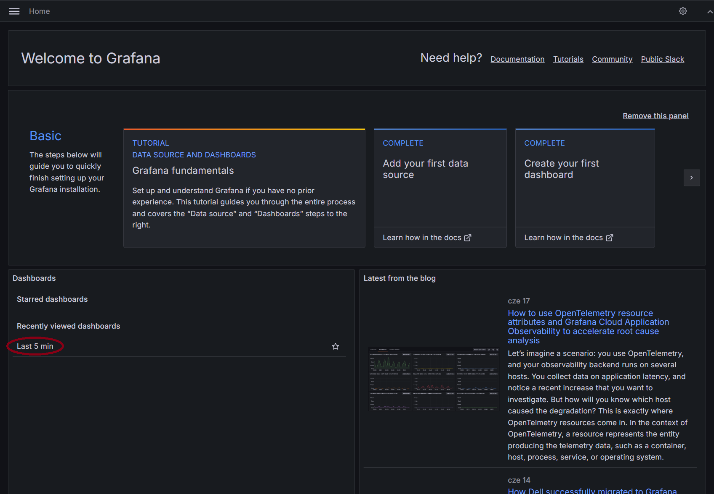

# About 
This project contains a labview app that simulates generating 
time domain data and contenerized application in FastAPI for 
storing data in InfluxDB and presenting with Grafana. 

# Prerequisites
1. Install [Docker Desktop](https://docs.docker.com/desktop/install/windows-install/) for Windows (docker and 
docker-compose needs to be installed).
2. Install labview runtime / labview.

# Run 
1. Run Docker Desktop 
2. Run command: `docker compose up`
3. For InfluxDB Web UI open: `localhost:8086` 
4. For Grafana Web UI open: `localhost:3000` 
5. Run labview application (make sure `docker compose up` was run first)

- START - start the acquisition, 
- SETTINGS - set the aquired signal type,
- STOP - stop the acquisition,
- EXIT - exit the applicaiton. 

6. Login into InfluxDB:
- LOGIN: `labview` 
- PASSWORD: `labview_password`

7. Login into Grafana
- LOGIN: `admin`
- PASSWORD: `labview_password`
- open `Last 5 min` dashboard

